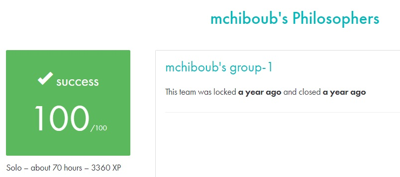

# PHILOSOPHERS #

## What the project does: ##
The Philosophers project simulates a classic concurrency problem where philosophers alternate between eating, thinking, and sleeping while sharing limited resources (forks). It introduces concepts of threading and synchronization using mutexes (or semaphores in the bonus part).

## Why the project is useful: ##
This project is useful because it teaches how to handle multiple threads and avoid issues like race conditions and deadlocks, which are essential for concurrent programming. These skills are critical in real-world applications that involve managing shared resources efficiently.

[Subject of this project](en.subject.pdf)